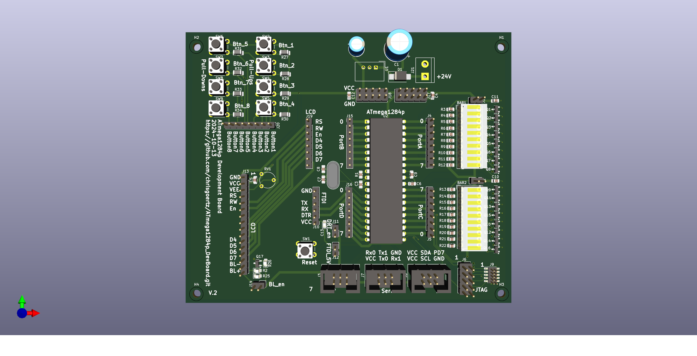
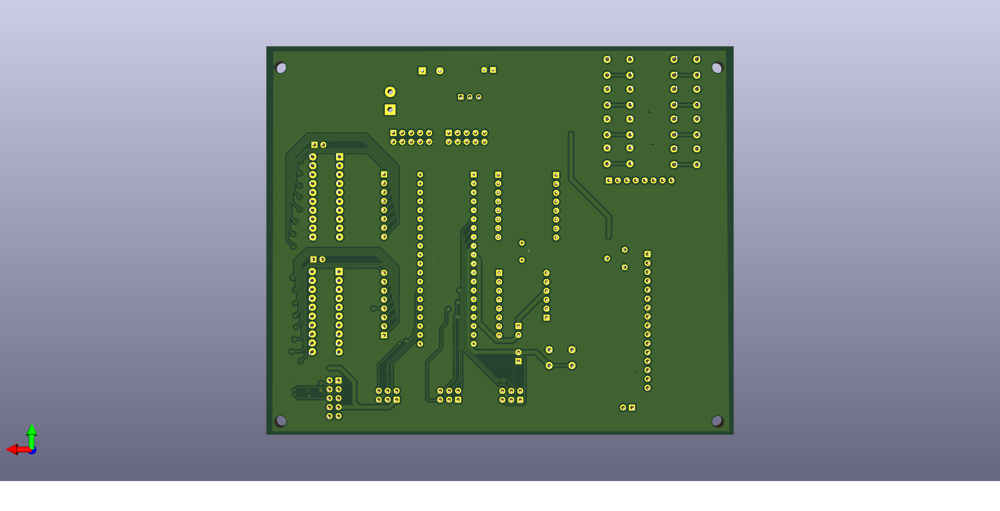

# ATmega1284p_DevBoard
AVR Developement Board
## Features
### LCD Connector
Precofigured Header for standard Character Display pinouts.
### Buttons
8 on board push buttons. 4 with attached pull-up resistor, 4 with
attached pull-down resistor.
### FTDI Connector
Standard FTDI Connector with attachable DTR enable like Arduino. 
So it is possible to reset and programm the MCU via FTDI connection
if a bootloader is flashed and enabled.
### JTAG Connector
2 AVR JTAG Headers for programming and debugging.
### ISP
Standard 6-pin AVR ISP.
### Serial
6-pin connector with UART0 and UART1 and also VCC and GND.
### I²C
6-Pin Connector with SDA and SCL, VCC, GND and GPIO D7.
### LED-BARs
2 10-Channel LED-Bars, attached to PortA and PortC. 
Both channels can be separate enabled by jumper. Since all
LEDs are decoupled via MOSFETs, they don't affect the GPIOs.

## Pictures

